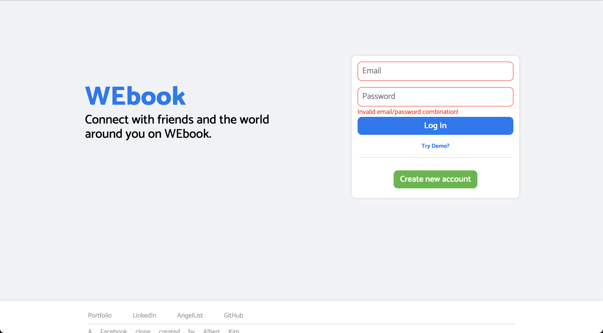
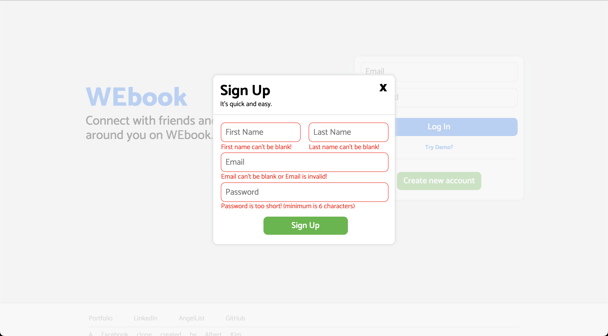

# WEbook

[Live site link](https://w3book.herokuapp.com/#/)

# Overview
WEbook is a Facebook clone which allows you to interact with your friends. Similar to the actual app, you can visit your friends' profile, add posts to either the main newsfeed or your and your friend's profile page, and comment on those posts. Additionally, you can also upload pictures and like both posts and comments. Not to forget, you are able to request to be friends with other users but you and the user will only become friends when the other user accepts the friend request.

I used the word 'we' to describe how I feel about Facebook nowadays. The app is one of the important social networking apps that helps connect people globally. Simultaneously, however, I thought the platform became a place where people just uploaded random and meaningless posts as well. Thus, I thought the word 'we' described the platform well because 'we' means 'us' but it can also be interpreted as 'whatever.'

# Features

## Account Creation and Authentication

When I started this project, I wanted to clone Facebook as best as I could because I thought I would learn a lot from copying. As a result, I located the login form on the right side of the page and used a modal for the sign up form. One thing I did differently compared to the actual app is the error rendeing. Instead of redirecting to another page to render the errors or have only exclamation points to empty inputs, I made sure the errors rendered underneath the input that caused the error.

## Post & Comment

In WEbook, you are able to create posts which includes functionalities such as edit/delete, upload picture, like, and comment. In the comments section, you are able to comment on a post and like the comment as well. Additionally, all the photos and names shown in the post and comment sections redirect you to the user's profile.

## Friends

WEbook has the functionality to request friend. When the request is sent out, the user receiving the request needs to accept in order for both you and the user to become friends. There is also the functionality to decline, so the user can reject the request as well. On top of the notification button, a number pops up to indicate how many friend requests the user has. Additionally, you are able to check your friends list in your profile page when you click on the 'Friends' button that is next to the 'Posts' button.

## Modals

A modal is rendered when you create/edit a post or edit your profile. In the modal, you are able to type anything you desire and also uplaod pictures. The modal also allows you to previe pictures you are about to upload.

# Technologies Used

- Javascript
- Node.js
- React
- Redux
- PostgreSQL
- AWS
- HTML
- CSS
- Ruby on Rails

# Future Edits

- Add search bar
